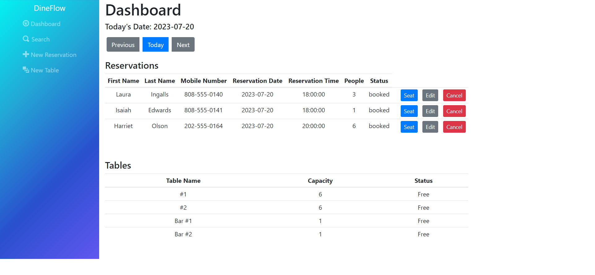

# Restaurant Reservation System: Periodic Tables

DineFlow is a full-stack restaurant reservation management application designed for restaurant owners and employees.
Users can create, view, and edit reservations as well as manage table seating settings.

## Live Project

- [Frontend Deployment](https://dineflow.onrender.com)
- [Backend Deployment](https://dineflow-backend.onrender.com)

## Technology Used

#### Frontend:

- JavaScript, React, React Router, HTML, CSS, Bootstrap

#### Backend:

- Node.js, Express, Knex, PostgreSQL

## Frontend Overview:

### Dashboard View:

### Create a new reservation:

### Edit a reservation:

### Create a new table:

### Seat a reservation:

### Find a reservation:

### Finish a reservation:

## Backend Overview:

The API allows for the following routes:

| Method | Route                                  | Description                              |
| ------ | -------------------------------------- | ---------------------------------------- |
| `GET`  | `/reservations`                        | List all reservations for current date   |
| `GET`  | `/reservations?date=YYYY-MM-DD`        | List all reservations for specified date |
| `POST` | `/reservations`                        | Create new reservation                   |
| `GET`  | `/reservations/:reservation_id`        | List reservation by ID                   |
| `PUT`  | `/reservations/:reservation_id`        | Update reservation                       |
| `PUT`  | `/reservations/:reservation_id/status` | Update reservation status                |

| `GET` | `/tables` | List all tables
| `POST` | `/tables` | Create new table
| `PUT` | `/tables/:table_id/seat` | Assign a table to a reservation (changes reservation's `status` to "seated")
| `DELETE` | `/tables/:table_id/seat` | Remove reservation from a table (changes reservation's `status` to "finished")

## Installation

1. Clone this repository `git clone https://github.com/cannonspears/dineflow.git`.
1. Navigate to the project directory using `cd dineflow`.
1. Run `cp ./back-end/.env.sample ./back-end/.env`.
1. Update the `./back-end/.env` file with the connection URL's to your database instance.
1. Run `cp ./front-end/.env.sample ./front-end/.env`.
1. You should not need to make changes to the `./front-end/.env` file unless you want to connect to a backend at a location other than `http://localhost:5001`.
1. Run `npm install` to install project dependencies.
1. Run `npm run start:dev` to start your server in development mode.

## Running Tests

This project includes a set of tests that can be run using the command line. To run the tests, use the command `npm test`.

## Author

This project was created by Cannon Spears in association with Thinkful.
